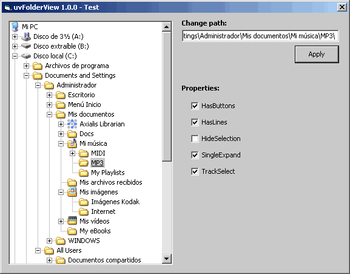

## API\-ucFolderView 1\.0

### Description

Basic FolderView user control (only standard folders). // 21Kb zip
 
### More Info
 

             |
---                |---
**Submitted On**   |2005-04-26 18:00:08
**By**             |[Carles P\.V\.](https://github.com/Planet-Source-Code/PSCIndex/blob/master/ByAuthor/carles-p-v.md)
**Level**          |Intermediate
**User Rating**    |4.8 (48 globes from 10 users)
**Compatibility**  |VB 6\.0
**Category**       |[Custom Controls/ Forms/  Menus](https://github.com/Planet-Source-Code/PSCIndex/blob/master/ByCategory/custom-controls-forms-menus__1-4.md)
**World**          |[Visual Basic](https://github.com/Planet-Source-Code/PSCIndex/blob/master/ByWorld/visual-basic.md)
**Archive File**   |[API\-ucFold1887985132005\.zip](https://github.com/Planet-Source-Code/carles-p-v-api-ucfolderview-1-0__1-56432/archive/master.zip)

